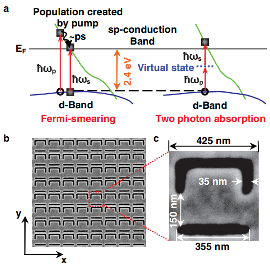
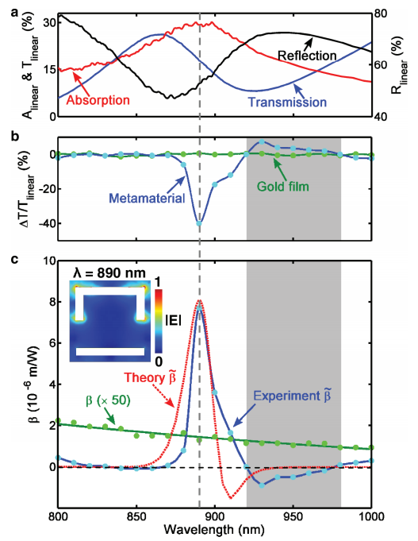
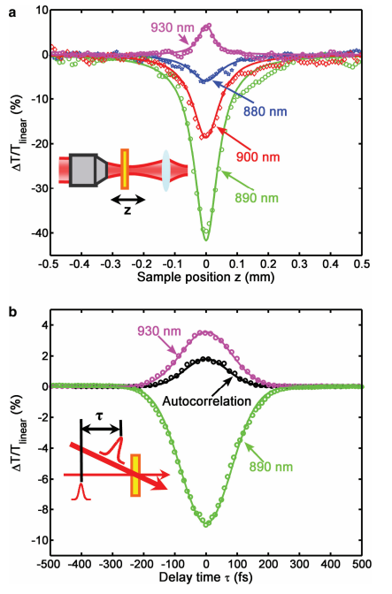

## Title
An	All-Optical,	Non-volatile,	Bidirectional,Phase-Change	Meta-Switch

## Authors
* Mengxin Ren
* Baohua Jia
* Jun-Yu Ou, Eric Plum
* Jianfa Zhang
* Kevin F. MacDonald
* Andrey E. Nikolaenko
* Jingjun Xu
* Min Gu
* Nikolay I. Zheludev

## Abstract
**Nanostructured Plasmonic Medium for Terahertz Bandwidth All-Optical Switching**  
Using a _nanostructured gold film_ to achieve an ultrafast resonant switch.  
Based on _Fermi-smearing_ and _two photon absorption_.  

## Highlight
**Fermi-smearing:** process in which light absorption at a frequency ωp leads to a non-equilibrium redistribution of electronsnear the Fermi level (EF). When probed at $\omega_s$ , this Fermi-smearing has most impact on transitions between the d-band states lying $\small \Delta E$ = 2.4 eV below the Fermi level to states above the Fermi level. Fermi-smearing leads to a very strong cubic optical nonlinearity and nonlinear absorption ($\small \beta \approx 10^{−5} \mathsf{m\,W^{−1}}$) peaking at a wavelength of about 516 nm.  

**two-photon absorption:** Direct two-photon absorption takes place without a real intermediate level as there are no empty states in the Fermi sea. It occurs through a virtual state when the energy of two incident photons is combined to bridge a gap that cannot be bridged by individual photons: $\small \hbar \omega_p + \hbar \omega_s \gt \Delta E$ . When characterized in a pump–probe experiment, the direct two-photon absorption nonlinearity has a very fast response time because it requires both the pump $\omega_p$ and the probe $\omega_s$ photons to be present simultaneously, and no slow decay carrier recombination is involved. In fact the uncertainty principle prescribes a finite lifetime for the virtual level, and thus a finite nonlinearity response time of order $\small \hbar/\delta E < 1\;\mathsf{fs}$, where $\small δE \approx \frac{1}{2} \Delta E$ is the energy difference between the virtual level and the nearest real state. Even with this limitation, this is an extremely fast degenerate cubic optical nonlinearity giving rise to a nonlinear absorption coefficient of order $\small 10^{−8} \mathsf m\,\mathsf W^{−1}$  

  
**Figure 1.** Metamaterial with giant plasmon-mediated femtosecond nonlinearity. a) Comparison between Fermi smearing and two-photon nonlinear responses in gold. b) Scanning electron microscopy (SEM) image of the nanostructured gold film. c) Detail of a single meta-molecule.

  
**Figure 2.** Metamaterial linear and nonlinear optical properties. a) Linear absorption, transmission, and reflection spectra of the metamaterial near its plasmonic resonance. Light is polarized in the y-direction as defined in Figure 1b. b) Nonlinear transmission change $\small ΔT/T$ linear at an illumination pulse peak intensity of 2.3 $\small \mathsf{GW\,cm^{−2}}$ for the metamaterial and an unstructured gold reference film. c) The metamaterial’s experimentally measured and theoretically evaluated effective two-photon absorption coefficient $\small \tilde \beta$ compared to that of an unstructured gold film $\small \beta$ (multiplied 50×). The shaded area shows the frequency range of absorption saturation. The inset shows a numerically simulated map of the electric field magnitude 10 nm below the gold surface at a wavelength of 890 nm.

  
**Figure 3.** Giant ultrafast nonlinearity of a plasmonic metamaterial. a) Z -scan traces taken at an average laser power level of 3 mW (data points) with corresponding analytical fits (lines) for a selection of characteristic wavelengths near the metamaterial’s plasmonic resonance. b) Time-resolved pump–probe scans showing nonlinear absorption and bleaching dynamics for the metamaterial alongside a reference second-harmonic autocorrelation envelope for the pulses.

## Related work
