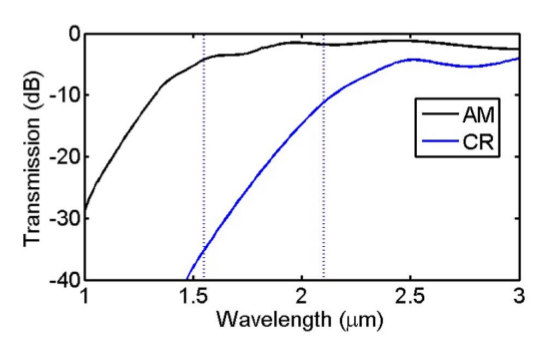

## Title
Electrically actuated phase-change pixels for transmissive and reflective spatial light modulators in the near and mid infrared

## Authors
* JOSHUA HENDRICKSON
* HAIBO LIANG
* RICHARD SOREF
* JIANWEI MU

## Abstract
An electrically actuated layer of phase-change material (PCM) was employed to build the transmissive and reflective spatial light modulators, the PCM was sandwiched between N-droped Si or indium tin oxide layers.   
Work at 1.55 (to 2.10) $\mu m$, that is, near- and mid- infred region.  
Focus on modulating and switching free-space light.

#### Conclusion
1.55 μm wavelength where 0.7 dB IL and 27 dB C(R) are
found in reflective SLMs as compared to 4.5 dB IL and
32 dB C(T) in transmissive SLMs. For both S and P polariza-
tion the simulated performance was relatively insensitive to
angle variation in the 0° to 25° range

#### SIMULATIONS OF INDIVIDUAL TRANSMISSIVE SLM PIXELS
N-doped Si's donor concentration: $1 \times 10^{19} \,cm^{-3}$  
Corresponding refractive index of Si: $3.4807 + 0.0015i$ at $1.55\,\mu m$  
GST layer index: $4.60 + 0.12i$ (amorphous), $6.98 + 1.84i$ (crystalline)  
Thickness of GST layer: 100 to 500 nm  
Thickness of doped semiconductor layer:200 or 500 nm   
Structure of device:  
  
Performance with different parameters:  
  

#### SIMULATIONS OF INDIVIDUAL REFLECTIVE SLM PIXELS
N-doped Si's donor concentration: $1 \times 10^{19} \,cm^{-3}$  
Performance at optimal parameter:  
  
Structure:  

## Highlight

**Electrical control** means that the PCM is sandwiched between two transparent conductors with voltage applied across the conductors. An applied field or current of suitable duration and strength then induces the desired phase change. Advantageously, the PCM film is **stable**, or **self-holding**, in either phase. External electric power is utilized only during the brief time of phase transition. The optical properties of the two phases differ rather dramatically, and this optical difference has a variety of important applications.  

An _antireflection (AR)_ layer is useful in the transmissive SLM,
while in the reflective SLM a _metallic mirror_ layer replaces one
of the transparent conducting layers.

In the present work, we assume that the PCM layer is divided into a two-dimensional (2D) N × M array of small pixel areas that are electrically addressed as individuals. Addressing would be done by structuring both electrical layers that contact the PCM. The front-plate contact is divided into electrically separate $X_i$ stripes, while the rear-plate contact has orthogonal $Y_j$ stripes, where i = 1...N and j = 1...M, thereby providing $X_i - Y_j$ addressing of individual pixels in the PCM layer.

#### Performance at different incidence angles
Calculated reflectivity as a function of incidence angle for
both S and P polarization in a device optimized at λ  1.55 μm.  
  
Transmitted Am and Cr intensity versus angle of incidence
for a 500 nm GST film thickness at λ  1.55 μm using 200 nm
N-doped Si contacts.  

#### Real and imaginary indexes versus wavelength
N-doped Si:  
  
GST:  

#### Performance of transmissive SLM
Transmitted Am and Cr intensity versus GST film thickness
at λ  1.55 μm using 200 nm N-doped Si contacts.  
  

#### Performance of reflective SLM
Calculated reflectance as a function of wavelength for an EO device optimized at λ  1.55 μm.  
  
Calculated reflectance as a function of wavelength for an EO device optimized at λ  2.10 μm.   
   

## Related work

#### Issues
**Challenge:** Implement a practical and effective technique for electrical addressing and temporal multiplexing of the N × M array of pixels in the PCM SLM.  
**Solution:** We are proposing that the **LC addressing structures** should be adapted and adopted in the PCM cases of transmissive and reflective SLMs. Commercial devices are available with logic supplies of <3.3 V and >12 V for driving pixels. In the present case, the set and reset pulse amplitudes are about 2 and 5 V, respectively, and the known circuitry can readily provide that.  

**Speed:** For 500 nm thick GST the **reset** pulse du-
ration is around **100 ns** and the **set** pulse duration is around
**1.5 ns**, with further reduction in GST thickness leading to
faster reset/set times.  

**Gray scale enhancement:** Binary operation is not always sufficient, and a scheme toextend our device performance from binary to gray scale would help to increase the potential application space. We speculate
that moderate sized “macro pixels,” each composed of **multiple
individual black/white pixels**, could be used for gray-scale production. Furthermore, gray-scale operation may also be obtainable through the **stacking of multiple layers of PCMs separated**
by additional conducting layers within a given pixel. Here, each
independent phase change layer could be switched, allowing
for multiple (>2) transmission (reflection) value states for a
given pixel.

**Upper limit thickness:** Finally, we note that there is in practice an upper limit on the PCM film thickness t which is determined by the maximum electric power that is acceptable for addressing a given
pixel (the $I^2 R$ Joule heating during reset is proportional to t). With this in mind, we have taken **t = 500 nm as the
upper limit**.

#### References
* Proposal of a small self-holding 2 × 2 optical switch using phase-change material
* Electro-optical switching at 1550 nm using a two-state GeSe phase-change layer
* Electro-optical 1 × 2, 1 × N, and N × N fiber optic and free-space switching over 1.55 to 3.0 $\mu m$ using a $\mathrm{Ge-Ge_2 Sb_2 Te_5 -Ge}$ prism structure
* Simulations of silicon-on-insulator channel waveguide electrooptical 2 × 2 switches and 1 × 1 modulators using a $\mathrm{Ge_2 Sb_2 Te_5}$ self-holding layer
* Electro-optic phase-change 2 × 2 switching using three- and four-waveguide directional couplers
* Waveguide-size hybrid $\mathrm{Si-VO_2}$ waveguide electroabsorption optical switches and photodetectors
