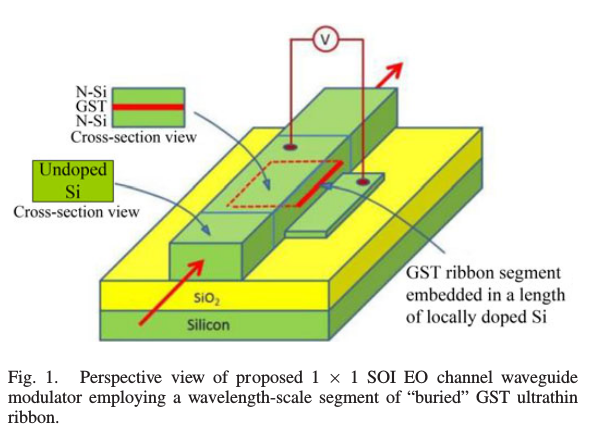
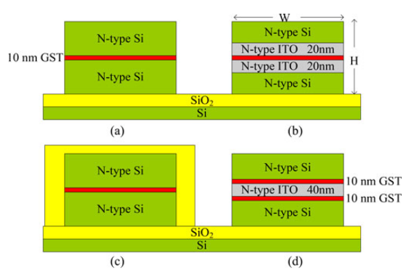
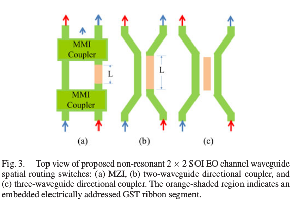
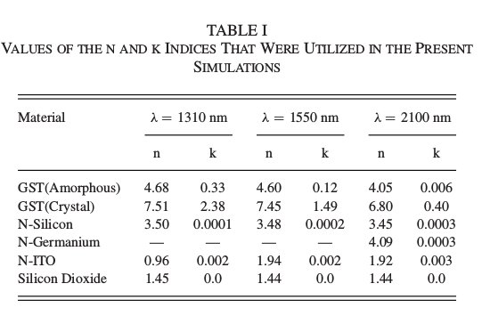
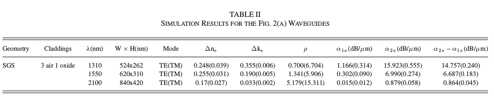
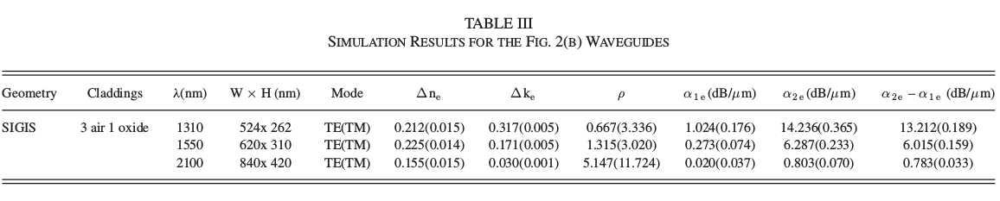
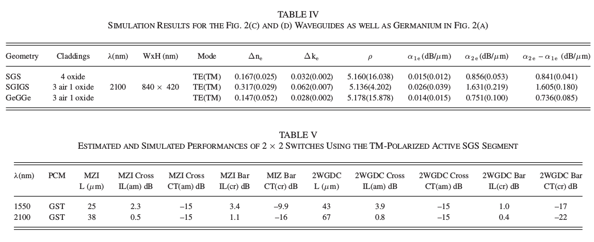
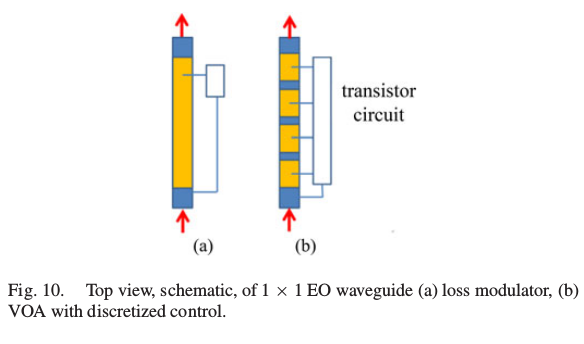

## Title
Simulations of Silicon-on-Insulator
Channel-Waveguide Electrooptical 2 × 2 Switches
and 1 × 1 Modulators Using a $\mathrm{Ge_2 Sb_2 Te_5}$
Self-Holding Layer

## Authors
* Haibo Liang
* Richard Soref
* Jianwei Mu
* Arka Majumdar
* Xun Li
* Wei-Ping Huang

## Abstract
2 × 2 switches and 1 × 1 loss modulators
based upon GST-embedded SOI channel waveguides

10-nm GST film sandwiched between doped-Si waveguide strips

1.3 to 2.1-$\mathrm{\mu m}$ wavelength range

2 × 2 Mach–Zehnder and directional coupler
switches

1 × 1 EO waveguide has application as a variable
optical attenuator and as a digital modulator for
1.3-2.1 $\mathrm{\mu m}$

## Highlight

The design presented here is new in two ways:  
(1) the thin film is placed midway in the body of the waveguide
where it has a much stronger effect upon the mode indices;  
(2) the phase change—rather than being optically triggered—is
electrically induced.
(3)utilize both the electro-refraction (ER) and the electro-
absorption (EA) component of the induced phase change   

  

Unexpectedly, the TE-polarized light is particularly
sensitive to the induced change of GST complex index $\mathrm{\Delta n +
i\,\Delta k}$, more so than in TM. Unexpectedly, the ratio $\mathrm{{\Delta n}/{\Delta k}}$ is
consistently higher in TM than TE. The loss suppression in TM
indicates that ER dominates in TM. Thus, with the anti-slot, TM
is more favorable for low-loss 2 × 2 switching, whereas TE is
the most natural mode polarization for 1 × 1 EA applications.

#### ELECTRICALLY INDUCED PHASE CHANGE
In detail, the recrystallization requires an applied set voltage
pulse of 100-ns duration that induces temperature rise
above **413 K** but below **819 K** (the melting point).

As for the changing process from crystalline to amorphous
state, a shorter reset voltage pulse of typically 1 to 10 ns duration
is employed, and there the GST film temperature must
be raised above the melting point(above the **891 K**
as desired) and then quenched rapidly by
the pulse falling to zero in < 1 ns.  

The voltages (5V and 15V) that we applied in both simulations might be
considered as “_relatively high_”; however, this is a trade-off we are
willing tomake to achieve optimum optical performances in the coming
sections.

#### PERFORMANCE GUIDELINES FOR 2 × 2 SWITCHES
   
The GST indices are written for the amorphous phase $\mathrm{n_{am} + i\,k_{am} = n_1 + i\,k_1}$ , and for the crystalline phase $\mathrm{n_{cr} + i\,k_{cr} = n_2 + i\,k_2}$ , while
the channel waveguide has a mode effective index in each state
written as $\mathrm{n_{1e} + i\,k_{1e}}$ and $\mathrm{n_{2e} + i\,k_{2e}}$ . Looking at the extinction
coefficient k, let us denote $\alpha$ as the absorption loss of the waveguide in decibel per micrometer in each state, $\mathrm{\alpha = 4.34(4\pi k/\lambda}$).
The IL of an amorphous active waveguide of length L is proportional to the product $\alpha$L, that is _IL_ (dB) = $\mathrm{4.34(4\pi k_{1e} L/\lambda}$) and the crystalline-phase loss is $\mathrm{4.34(4\pi k_{2e} L/\lambda}$). The extinction ratio of a loss modulator discussed below is then _ER_ (dB) = $\mathrm{(k_{2e} – k_{1e})(4.34)(4\pi L/\lambda})$.  

Loss modulation utilizes EA, while ER is mostly neglected: 2 × 2 switching relies upon ER, with additional requirements that: (1) ER >> EA, and (2) absorption loss in the initial cross state is low.

In switches, it is the product of the phase factor $\Delta \beta$ with
L, that affects the transfer of light from the input guide to the
output guide, where $\mathrm{\Delta \beta L = (2\pi/\lambda)(n_{2e} – n_{1e})}$. Values of $\Delta \beta$L from 3 to 18 are required, depending upon the switch geometry and upon whether the device is resonant or non-resonant.
Specifically the Mach–Zehnder interferometer (MZI)
requires $\Delta \beta$L = $\pi$ rad, while the two-waveguide directional coupler needs $\Delta \beta$L = 5.4 rad, and the three-waveguide directional coupler requires $\Delta \beta$L = 18 rad.  
To minimize _IL_ and crosstalk (_CT_) in both switching states, we generally desire $\mathrm{n_{2e} – n_{1e} >> k_{2e} – k_{1e}}$ with the ratio $\mathrm{\rho = (n_{2e} – n_{1e})/(k_{2e} – k_{1e})}$ being as high as possible.

#### RESULTS OF NUMERICAL SIMULATIONS
**PREDICTED 2 × 2 SWITCHING PERFORMANCE:**  
  
  
  
  
**PREDICTED 1 × 1 MODULATOR AND VOA PERFORMANCE:**  
  

## Related work
* Ultra-small self-holding, optical gate switch using $\mathrm{Ge_2 Sb_2 Te_5}$ with a multi-mode Si waveguide
* Small-sized Mach-Zehnder interferometer optical switch using thin film $\mathrm{Ge_2 Sb_2 Te_5}$ phase-change material
* Mid-infrared 2 × 2 electro-optical switching by silicon and germanium three-waveguide and four-waveguide directional couplers using free-carrier injection
* An all-optical non-volatile, bidirectional, phase-change meta-switch
* Self-holding optical switch using phase-change material for energy efficient photonic network
